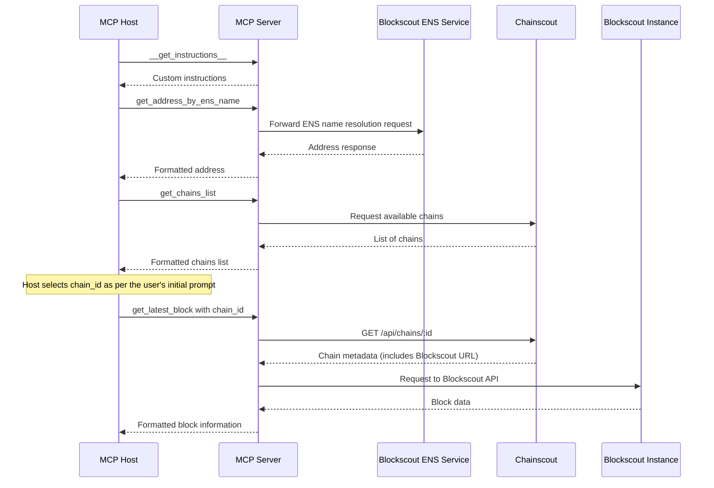
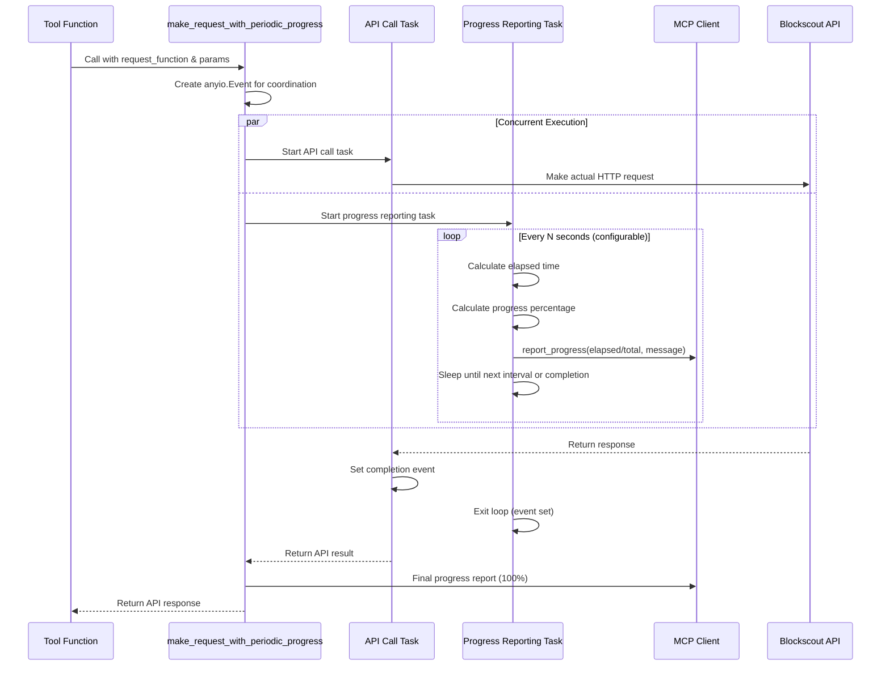

# Blockscout MCP Server

This server wraps Blockscout APIs and exposes blockchain data—balances, tokens, NFTs, contract metadata—via MCP so that AI agents and tools (like Claude, Cursor, or IDEs) can access and analyze it contextually.

## Technical details

- The server is built using [MCP Python SDK](https://github.com/modelcontextprotocol/python-sdk) and Httpx.

### Architecture and Data Flow

### Workflow Description

1. **Instructions Retrieval**:
   - MCP Host requests custom instructions via `__get_instructions__`
   - MCP Server provides context-specific guidance

2. **ENS Resolution**:
   - MCP Host requests address resolution via `get_address_by_ens_name`
   - MCP Server forwards the request to Blockscout ENS Service
   - Response is processed and formatted before returning to the agent

3. **Chain Selection**:
   - MCP Host requests available chains via `get_chains_list`
   - MCP Server retrieves chain data from Chainscout
   - MCP Host selects appropriate chain based on user needs

4. **Blockchain Data Retrieval**:
   - MCP Host requests blockchain data (e.g., `get_latest_block`) with specific chain_id, optionally requesting progress updates
   - MCP Server, if progress is requested, reports starting the operation
   - MCP Server queries Chainscout for chain metadata including Blockscout instance URL
   - MCP Server reports progress after resolving the Blockscout URL
   - MCP Server forwards the request to the appropriate Blockscout instance
   - For potentially long-running API calls (e.g., advanced transaction filters), MCP Server provides periodic progress updates every 15 seconds (configurable via `BLOCKSCOUT_PROGRESS_INTERVAL_SECONDS`) showing elapsed time and estimated duration
   - MCP Server reports progress after fetching data from Blockscout
   - Response is processed and formatted before returning to the agent

### Key Architectural Decisions

1. **Tool Selection and Context Optimization**:
   - Not all Blockscout API endpoints are exposed as MCP tools
   - The number of tools is deliberately kept minimal to prevent diluting the LLM context
   - Too many tools make it difficult for the LLM to select the most appropriate one for a given user prompt
   - Some MCP Hosts (e.g., Cursor) have hard limits on the number of tools (capped at 50)
   - Multiple MCP servers might be configured in a client application, with each server providing its own tool descriptions
   - Tool descriptions are limited to 1024 characters to minimize context consumption

2. **Response Processing and Optimization**:
   - Raw Blockscout API responses are not forwarded directly to the MCP Host
   - Responses are processed to extract only tool-relevant data before returning to the MCP Host
   - This approach prevents overwhelming the LLM context window with excessive blockchain data
   - For example, token list responses that could contain hundreds of entries are filtered and formatted to include only essential information

3. **Instructions Delivery Workaround**:
   - Although the MCP specification defines an `instructions` field in the initialization response (per [MCP lifecycle](https://modelcontextprotocol.io/specification/2025-03-26/basic/lifecycle#initialization)), current MCP Host implementations (e.g., Claude Desktop) do not reliably use these instructions
   - The `__get_instructions__` tool serves as a workaround for this limitation
   - The tool's description forces the MCP Host to call it before any other tools in the session
   - These custom instructions are crucial for providing the LLM with blockchain-specific context
   - Instructions could include information about chain IDs, common error handling patterns, and examples of how to reason about blockchain data and DeFi protocols

### Performance Optimizations and User Experience

#### Periodic Progress Tracking for Long-Running API Calls

The server implements sophisticated progress tracking for potentially long-running API operations, particularly for tools that query the Blockscout `/api/v2/advanced-filters` endpoint (such as `get_transactions_by_address` and `get_token_transfers_by_address`). This feature significantly improves user experience by providing real-time feedback during operations that may take 30 seconds or more.

**Technical Implementation:**

The progress tracking system uses a wrapper function (`make_request_with_periodic_progress`) that employs concurrent task execution to provide periodic updates without blocking the actual API call. The implementation leverages Python's `anyio` library for structured concurrency.

**Key Implementation Details:**

1. **Concurrent Task Management**: Uses `anyio.create_task_group()` to run the API call and progress reporting concurrently
2. **Event-Driven Coordination**: An `anyio.Event` coordinates between tasks - the progress task continues until the API task signals completion
3. **Dynamic Progress Calculation**: Progress within the current step is calculated as `min(elapsed_time / expected_duration, 1.0)` to ensure it never exceeds 100%
4. **Multi-Step Integration**: The wrapper integrates seamlessly with the overall tool progress tracking by accepting `tool_overall_total_steps` and `current_step_number` parameters
5. **Configurable Intervals**: Progress reporting frequency is configurable via `BLOCKSCOUT_PROGRESS_INTERVAL_SECONDS` (default: 15 seconds)
6. **Error Handling**: Exceptions from the API call are properly propagated while ensuring progress task cleanup
