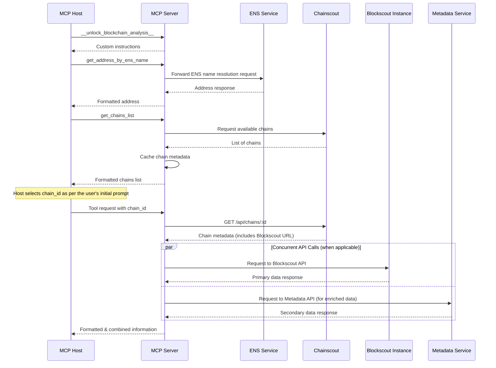
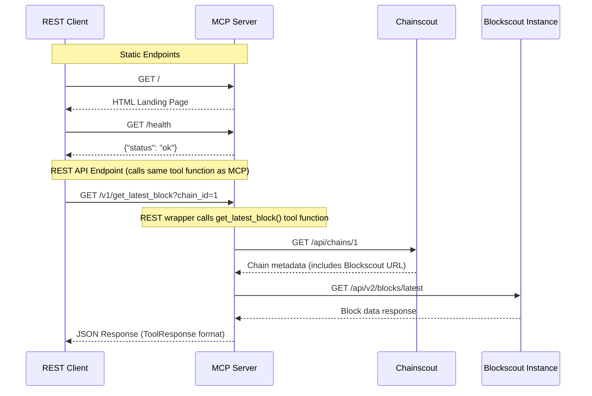
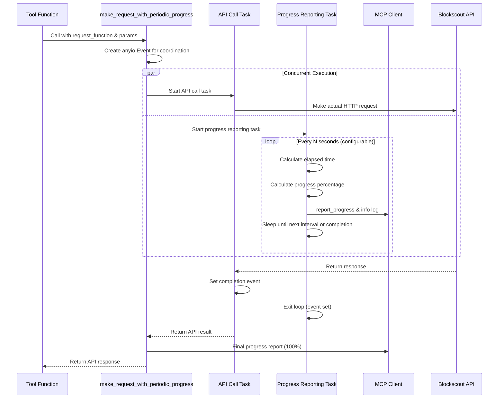

# Blockscout MCP Server

This server wraps Blockscout APIs and exposes blockchain data—balances, tokens, NFTs, contract metadata—via MCP so that AI agents and tools (like Claude, Cursor, or IDEs) can access and analyze it contextually.

## Technical details

- The server is built using [MCP Python SDK](https://github.com/modelcontextprotocol/python-sdk) and Httpx.

### Operational Modes

The Blockscout MCP Server supports two primary operational modes:

1. **Stdio Mode (Default)**:
   - Designed for integration with MCP hosts/clients (Claude Desktop, Cursor, MCP Inspector, etc.)
   - Uses stdin/stdout communication following the MCP JSON-RPC 2.0 protocol
   - Automatically spawned and managed by MCP clients
   - Provides session-based interaction with progress tracking and context management

2. **HTTP Mode**:
   - Enabled with the `--http` flag.
   - By default, this mode provides a pure MCP-over-HTTP endpoint at `/mcp`, using the same JSON-RPC 2.0 protocol as stdio mode.
   - It is stateless and uses JSON responses, making it convenient for testing and integration.

   The HTTP mode can be optionally extended to serve additional web and REST API endpoints. This is disabled by default and can be enabled by providing the `--rest` flag at startup.

3. **Extended HTTP Mode (with REST API and Web Pages)**:
   - Enabled by using the `--rest` flag in conjunction with `--http`.
   - This mode extends the standard HTTP server to include additional, non-MCP endpoints:
     - A simple landing page at `/` with human-readable instructions.
     - A health check endpoint at `/health`.
     - A machine-readable policy file at `/llms.txt` for AI crawlers.
     - A versioned REST API under `/v1/` that exposes the same functionality as the MCP tools.
   - This unified server approach allows both MCP clients and traditional REST clients to interact with the same application instance, ensuring consistency and avoiding code duplication.

The core tool functionality is identical across all modes; only the transport mechanism and available endpoints differ.

### Architecture and Data Flow



### REST API Data Flow (Extended HTTP Mode)

When the server runs in extended HTTP mode (`--http --rest`), it provides additional REST endpoints alongside the core MCP functionality. The REST endpoints are thin wrappers that call the same underlying tool functions used by the MCP server.



### Unified Server Architecture

The `FastMCP` server from the MCP Python SDK is built on top of FastAPI, which allows for the registration of custom routes. When running in the extended HTTP mode (`--http --rest`), the server leverages this capability to add non-MCP endpoints directly to the `FastMCP` instance.

- **Single Application Instance**: The `FastMCP` server itself serves all traffic, whether it's from an MCP client to `/mcp` or a REST client to `/v1/...`. There is no need to mount a separate application.
- **Shared Business Logic**: The REST API endpoints are thin wrappers that directly call the same underlying tool functions used by the MCP server. This ensures that any bug fix or feature enhancement to a tool is immediately reflected in both interfaces.
- **Centralized Routing**: All routes, both for MCP and the REST API, are handled by the single `FastMCP` application instance.

This architecture provides the flexibility of a multi-protocol server without the complexity of running multiple processes or duplicating code, all while using the built-in features of the MCP Python SDK.

### Workflow Description

1. **Instructions Retrieval**:
   - MCP Host requests custom instructions via `__unlock_blockchain_analysis__`
   - MCP Server provides context-specific guidance

2. **ENS Resolution**:
   - MCP Host requests address resolution via `get_address_by_ens_name`
   - MCP Server forwards the request to Blockscout ENS Service
   - Response is processed and formatted before returning to the agent

3. **Chain Selection**:
   - MCP Host requests available chains via `get_chains_list`
   - MCP Server retrieves chain data from Chainscout.
   - The snapshot is cached in-process with a TTL (configurable via `BLOCKSCOUT_CHAINS_LIST_TTL_SECONDS`).
   - The per-chain `ChainCache` is warmed via `bulk_set` on each refresh.
   - Concurrent refreshes are deduplicated with an async lock.
   - MCP Host selects appropriate chain based on user needs

4. **Optimized Data Retrieval with Concurrent API Calls**:
   - The MCP Server employs concurrent API calls as a performance optimization whenever tools need data from multiple sources. Examples include:
     - `get_address_info`: Concurrent requests to Blockscout API (for on-chain data) and Metadata API (for public tags)
     - `get_block_info` with transactions: Concurrent requests for block data and transaction list from the same Blockscout instance
   - This approach significantly reduces response times by parallelizing independent API calls rather than making sequential requests. The server combines all responses into a single, comprehensive response for the agent.

5. **Blockchain Data Retrieval**:
   - MCP Host requests blockchain data (e.g., `get_latest_block`) with specific chain_id, optionally requesting progress updates
   - MCP Server, if progress is requested, reports starting the operation
   - MCP Server queries Chainscout for chain metadata including Blockscout instance URL
   - MCP Server reports progress after resolving the Blockscout URL
   - MCP Server forwards the request to the appropriate Blockscout instance
   - For potentially long-running API calls (e.g., advanced transaction filters), MCP Server provides periodic progress updates every 15 seconds (configurable via `BLOCKSCOUT_PROGRESS_INTERVAL_SECONDS`) showing elapsed time and estimated duration
   - MCP Server reports progress after fetching data from Blockscout
   - Response is processed and formatted before returning to the agent

### Key Architectural Decisions

1. **Unified Server via MCP SDK Extensibility**:
   - To support both MCP and a traditional REST API without duplicating logic, the server leverages the extensibility of the `FastMCP` class from the MCP Python SDK. This is motivated by several integration scenarios:
     - **Gateway Integration**: To enable easier integration with API gateways and marketplaces like Higress.
     - **AI-Friendly Stop-Gap**: To provide an AI-friendly alternative to the raw Blockscout API.
     - **Non-MCP Agent Support**: To allow agents without native MCP support to use the server's functionality.
   - The core MCP tool functions (e.g., `get_latest_block`) serve as the single source of truth for business logic.
   - The REST API endpoints under `/v1/` are simple wrappers that call these tool functions. They are registered directly with the `FastMCP` instance using its `custom_route` method.
   - This approach ensures consistency between the two protocols, simplifies maintenance, and allows for a single deployment process.
   - This extended functionality is opt-in via a `--rest` command-line flag to maintain the server's primary focus as an MCP-first application.

2. **Tool Selection and Context Optimization**:
   - Not all Blockscout API endpoints are exposed as MCP tools
   - The number of tools is deliberately kept minimal to prevent diluting the LLM context
   - Too many tools make it difficult for the LLM to select the most appropriate one for a given user prompt
   - Some MCP Hosts (e.g., Cursor) have hard limits on the number of tools (capped at 50)
   - Multiple MCP servers might be configured in a client application, with each server providing its own tool descriptions
   - Tool descriptions are limited to 1024 characters to minimize context consumption

3. **The Standardized `ToolResponse` Model**

   To provide unambiguous, machine-readable responses, the server enforces a standardized, structured response format for all tools. This moves away from less reliable string-based outputs and aligns with modern API best practices.

   Every tool in the server returns a `ToolResponse` object. This Pydantic model serializes to a clean JSON structure, which clearly separates the primary data payload from associated metadata.

   The core structure is as follows:

   - `data`: The main data payload of the tool's response. The schema of this field can be specific to each tool.
   - `data_description`: An optional list of strings that explain the structure, fields, or conventions of the `data` payload (e.g., "The `method_call` field is actually the event signature...").
   - `notes`: An optional list of important contextual notes, such as warnings about data truncation or data quality issues. This field includes guidance on how to retrieve full data if it has been truncated.
   - `instructions`: An optional list of suggested follow-up actions for the LLM to plan its next steps. When pagination is available, the server automatically appends pagination instructions to motivate LLMs to fetch additional pages.
   - `pagination`: An optional object that provides structured information for retrieving the next page of results.

   This approach provides immense benefits, including clarity for the AI, improved testability, and a consistent, predictable API contract.

   **Example: Comprehensive ToolResponse Structure**

   This synthetic example demonstrates all features of the standardized `ToolResponse` format that tools use to communicate with the AI agent. It shows how the server structures responses with the primary data payload, contextual metadata, pagination, and guidance for follow-up actions.

    ```json
    {
      "data": [
        {
          "block_number": 19000000,
          "transaction_hash": "0x1a2b3c4d5e6f...",
          "token_symbol": "USDC",
          "amount": "1000000000",
          "from_address": "0xa1b2c3d4e5f6...",
          "to_address": "0xf6e5d4c3b2a1...",
          "raw_data": "0x1234...",
          "raw_data_truncated": true,
          "decoded_data": {
            "method": "transfer",
            "parameters": [
              {"name": "to", "value": "0xf6e5d4c3b2a1...", "type": "address"},
              {"name": "amount", "value": "1000000000", "type": "uint256"}
            ]
          }
        }
      ],
      "data_description": [
        "Response Structure:",
        "- `block_number`: Block height where the transaction was included",
        "- `token_symbol`: Token ticker (e.g., USDC, ETH, WBTC)",
        "- `amount`: Transfer amount in smallest token units (wei for ETH)",
        "- `raw_data`: Transaction input data (hex encoded). **May be truncated.**",
        "- `raw_data_truncated`: Present when `raw_data` field has been shortened",
        "- `decoded_data`: Human-readable interpretation of the raw transaction data"
      ],
      "notes": [
        "Large data fields have been truncated to conserve context (indicated by `*_truncated: true`).",
        "For complete untruncated data, retrieve it directly:",
        "`curl \"https://eth.blockscout.com/api/v2/transactions/0x1a2b3c4d5e6f.../raw-trace\"`"
      ],
      "instructions": [
        "Use `get_address_info` to get detailed information about any address in the results",
        "Use `get_transaction_info` to get full transaction details including gas usage and status",
        "⚠️ MORE DATA AVAILABLE: Use pagination.next_call to get the next page.",
        "Continue calling subsequent pages if you need comprehensive results."
      ],
      "pagination": {
        "next_call": {
          "tool_name": "get_address_transactions", 
          "params": {
            "chain_id": "1",
            "address": "0xa1b2c3d4e5f6...",
            "cursor": "eyJibG9ja19udW1iZXIiOjE4OTk5OTk5LCJpbmRleCI6NDJ9"
          }
        }
      }
    }
    ```

4. **Async Web3 Connection Pool**:
   - The server uses a custom `AsyncHTTPProviderBlockscout` and `Web3Pool` to interact with Blockscout's JSON-RPC interface.
   - Connection pooling reuses TCP connections, reducing latency and resource usage.
   - The provider ensures request IDs never start at zero and normalizes parameters to lists for Blockscout compatibility.
   - A shared `aiohttp` session enforces global and per-host connection limits to prevent overload.

5. **Blockscout-Hosted Chain Filtering**:

   The `get_chains_list` tool intentionally returns only chains that are hosted
   by the Blockscout team. This ensures a consistent feature set, stable service
   levels, and the ability to authenticate requests from the MCP server. Chains
   without an official Blockscout instance are omitted.

6. **Response Processing and Context Optimization**:

   The server employs a comprehensive strategy to **conserve LLM context** by intelligently processing API responses before forwarding them to the MCP Host. This prevents overwhelming the LLM context window with excessive blockchain data, ensuring efficient tool selection and reasoning.

   **Core Approach:**
   - Raw Blockscout API responses are never forwarded directly to the MCP Host
   - All responses are processed to extract only tool-relevant data
   - Large datasets (e.g., token lists with hundreds of entries) are filtered and formatted to include only essential information
   - Contract source code is not returned by tools to conserve context; when contract metadata is needed, only the ABI may be returned (sources are omitted).

   **Specific Optimizations:**

    **a) Address Object Simplification:**
    Many Blockscout API endpoints return addresses as complex JSON objects containing hash, name, contract flags, public tags, and other metadata. To conserve LLM context, the server systematically simplifies these objects into single address strings (e.g., `"0x123..."`) before returning responses. This approach:

    - **Reduces Context Consumption**: A single address string uses significantly less context than a full address object with multiple fields
    - **Encourages Compositional Tool Use**: When detailed address information is needed, the AI is guided to use dedicated tools like `get_address_info`
    - **Maintains Essential Functionality**: The core address hash is preserved, which is sufficient for most blockchain operations

    **b) Opaque Cursor Strategy for Pagination:**
    For handling large, paginated datasets, the server uses an **opaque cursor** strategy that avoids exposing multiple, complex pagination parameters (e.g., `page`, `offset`, `items_count`) in tool signatures and responses. This approach provides several key benefits:

    - **Context Conservation**: A single cursor string consumes significantly less LLM context than a list of individual parameters.
    - **Improved Robustness**: It treats pagination as an atomic unit, preventing the AI from incorrectly constructing or omitting parameters for the next request.
    - **Simplified Tool Signatures**: Tool functions only need one optional `cursor: str` argument for pagination, keeping their schemas clean.

    **Mechanism:**
    When the Blockscout API returns a `next_page_params` dictionary, the server serializes this dictionary into a compact JSON string, which is then Base64URL-encoded. This creates a single, opaque, and URL-safe string that serves as the cursor for the next page.

    **Example:**

    - **Blockscout API `next_page_params`:**

       ```json
       { "block_number": 18999999, "index": 42, "items_count": 50 }
       ```

    - **Generated Opaque Cursor:**
       `eyJibG9ja19udW1iZXIiOjE4OTk5OTk5LCJpbmRleCI6NDIsIml0ZW1zX2NvdW50Ijo1MH0`

    - **Final Tool Response (JSON):**

      ```json
      {
        "data": [...],
        "pagination": {
          "next_call": {
            "tool_name": "get_transaction_logs",
            "params": {
              "chain_id": "1",
              "hash": "0x...",
              "cursor": "eyJibG9ja19udW1iZXIiOjE4OTk5OTk5LCJpbmRleCI6NDIsIml0ZW1zX2NvdW50Ijo1MH0"
            }
          }
        }
      }
      ```

    **c) Response Slicing and Context-Aware Pagination:**

    To prevent overwhelming the LLM with long lists of items (e.g., token holdings, transaction logs), the server implements a response slicing strategy. This conserves context while ensuring all data remains accessible through robust pagination.

    **Basic Slicing Mechanism:**

    - The server fetches a full page of data from the Blockscout API (typically 50 items) but returns only a smaller, configurable slice to the client (e.g., 10 items). If the original response contained more items than the slice size, pagination is initiated.
    - **Cursor Generation**: Instead of using the `next_page_params` directly from the Blockscout API (which would skip most of the fetched items), the server generates a new pagination cursor based on the **last item of the returned slice**. This ensures the next request starts exactly where the previous one left off, providing seamless continuity.
    - **Configuration**: The size of the slice returned to the client is configurable via environment variables (e.g., `BLOCKSCOUT_*_PAGE_SIZE`), allowing for fine-tuning of context usage.

    **Advanced Multi-Page Fetching with Filtering:**
    For tools that apply significant filtering (e.g., `get_transactions_by_address` which excludes token transfers), the server implements a sophisticated multi-page fetching strategy to handle cases where filtering removes most items from each API page:

    - **Smart Pagination Logic**: The server fetches up to 10 consecutive full-size pages from the Blockscout API, filtering and accumulating items until it has enough for a meaningful client response.
    - **Sparse Data Detection**: If after fetching 10 pages the last page contained no filtered items and the accumulated results are still insufficient for a full client page, the data is considered "too sparse" and pagination is terminated to avoid infinite loops with minimal results.
    - **Pagination Decision**: The server offers pagination to the client only when:
      1. It has accumulated more than the target page size (definitive evidence of more data), OR
      2. It reached the 10-page limit AND the last fetched page contained items AND the API indicates more pages are available (likely more data)
    - **Efficiency Balance**: This approach balances network efficiency (fetching larger chunks) with context efficiency (returning smaller slices) while handling the complex reality of heavily filtered blockchain data.

    This strategy combines the network efficiency of fetching larger data chunks from the backend with the context efficiency of providing smaller, digestible responses to the AI.

    **d) Automatic Pagination Instructions for LLM Guidance:**

    To address the common issue of LLMs ignoring structured pagination data, the server implements a multi-layered approach to ensure LLMs actually use pagination when available:

    - **Enhanced General Rules**: Server instructions include explicit pagination handling rules that LLMs receive upfront
    - **Automatic Instruction Generation**: When a tool response includes pagination, the server automatically appends motivational instructions to the `instructions` field (e.g., "⚠️ MORE DATA AVAILABLE: Use pagination.next_call to get the next page.")
    - **Tool Description Enhancement**: All paginated tools include prominent **"SUPPORTS PAGINATION"** notices in their docstrings

    This balanced approach provides both human-readable motivation and machine-readable execution details, significantly improving the likelihood that LLMs will fetch complete datasets for comprehensive analysis.

    **e) Log Data Field Truncation**

    To prevent LLM context overflow from excessively large `data` fields in transaction logs, the server implements a smart truncation strategy.

    - **Mechanism**: If a log's `data` field (a hex string) exceeds a predefined limit of 514 characters (representing 256 bytes of data plus the '0x' prefix), it is truncated.
    - **Flagging**: A new boolean field, `data_truncated: true`, is added to the log item to explicitly signal that the data has been shortened.
    - **Decoded Truncation**: Oversized string values inside the `decoded` dictionary are recursively replaced with `{"value_sample": "...", "value_truncated": true}`.
    - **Guidance**: When truncation occurs, a note is added to the tool's output. This note explains the flag and provides a `curl` command template, guiding the agent on how to programmatically fetch the complete, untruncated data if required for deeper analysis.

    This approach maintains a small context footprint by default while providing a reliable "escape hatch" for high-fidelity data retrieval when necessary.

    **f) Transaction Input Data Truncation**

    To handle potentially massive transaction input data, the `get_transaction_info` tool employs a multi-faceted truncation strategy.

    - **`raw_input` Truncation**: If the raw hexadecimal input string exceeds `INPUT_DATA_TRUNCATION_LIMIT`, it is shortened. A new flag, `raw_input_truncated: true`, is added to the response to signal this.
    - **`decoded_input` Truncation**: The server recursively traverses the nested `parameters` of the decoded input. Any string value (e.g., a `bytes` or `string` parameter) exceeding the limit is replaced by a structured object: `{"value_sample": "...", "value_truncated": true}`. This preserves the overall structure of the decoded call while saving significant context.
    - **Instructional Note**: If any field is truncated, a note is appended to the tool's output, providing a `curl` command to retrieve the complete, untruncated data, ensuring the agent has a path to the full information if needed.

7. **HTTP Request Robustness**

   Blockscout HTTP requests are centralized via the helper `make_blockscout_request`. To improve resilience against transient, transport-level issues observed in real-world usage (for example, incomplete chunked reads), the helper employs a small and conservative retry policy:

   - Applies only to idempotent GETs (this function is GET-only)
   - Retries up to 3 attempts on `httpx.RequestError` (transport errors)
   - Does not retry on `httpx.HTTPStatusError` (4xx/5xx responses)
   - Uses short exponential backoff between attempts (0.5s, then 1.0s)

   Configuration:
   - The maximum number of retry attempts is configurable via the environment variable `BLOCKSCOUT_BS_REQUEST_MAX_RETRIES` (default: `3`).

   This keeps API semantics intact, avoids masking persistent upstream problems, and improves reliability for both MCP tools and the REST API endpoints that proxy through the same business logic.

### Instructions Delivery and the `__unlock_blockchain_analysis__` Tool

#### The Initial Problem: Bypassed Server Instructions

Although the MCP specification defines an `instructions` field in the initialization response (per [MCP lifecycle](https://modelcontextprotocol.io/specification/2025-03-26/basic/lifecycle#initialization)), empirical testing with various MCP Host implementations (e.g., Claude Desktop) revealed that these server-level instructions are not reliably processed or adhered to by the AI agent. This creates a significant challenge, as the agent lacks the essential context and operational rules needed to interact with the blockchain data tools effectively.

#### The First-Generation Workaround: `__get_instructions__`

To mitigate this, the server initially implemented a tool named `__get_instructions__`. The tool's description was designed to be highly persuasive, instructing the agent that it was a mandatory first step.

However, further testing showed this approach was insufficient. LLMs often treated the tool as optional guidance—akin to a "Read Me" file—rather than a non-negotiable prerequisite. Despite increasingly forceful descriptions, agents would frequently skip this step in their eagerness to answer the user's prompt directly, leading to suboptimal or incorrect tool usage.

#### The Revised Strategy: From Persuasion to Structural Guidance

The core issue was identified as a flaw in the interaction design: we were trying to *persuade* the agent with natural language instead of *structurally guiding* its behavior. The solution was to change the tool's fundamental identifier—its name—to create a more powerful and unambiguous signal.

The tool was renamed to `__unlock_blockchain_analysis__`.

This name was chosen deliberately for several reasons based on observed LLM behavior:

1. **Creates a Strong Semantic Imperative**: The verb "unlock" implies a necessary, state-changing action that must be performed before other operations can succeed. It reframes the tool from an optional piece of information to a functional prerequisite.

2. **Aligns with LLM's Sequential Processing**: LLMs are trained on vast amounts of code and documentation that follow a clear `initialize -> execute` or `setup -> run` pattern. The `unlock -> analyze` narrative fits this ingrained sequential model, making it a natural and logical first step for the agent to take.

3. **Provides a Coherent and Compelling Narrative**: The name, combined with a description stating that other tools are "locked," creates a simple and powerful story for the agent: "To begin my work, I must first call the `__unlock_blockchain_analysis__` tool." This is far more effective than the ambiguous `__get_instructions__` which lacks a clear call to action.

This revised strategy, which combines the action-oriented name with a direct and explicit description, has proven to be significantly more effective at ensuring the agent performs the critical initialization step. While the probabilistic nature of LLMs means no single change can guarantee 100% compliance, this approach of structural guidance has yielded far more consistent and reliable behavior than attempts at mere persuasion.

### Performance Optimizations and User Experience

#### Periodic Progress Tracking for Long-Running API Calls

The server implements sophisticated progress tracking for potentially long-running API operations, particularly for tools that query the Blockscout `/api/v2/advanced-filters` endpoint (such as `get_transactions_by_address` and `get_token_transfers_by_address`). This feature significantly improves user experience by providing real-time feedback during operations that may take 30 seconds or more.

**Technical Implementation:**

The progress tracking system uses a wrapper function (`make_request_with_periodic_progress`) that employs concurrent task execution to provide periodic updates without blocking the actual API call. The implementation leverages Python's `anyio` library for structured concurrency.



**Key Implementation Details:**

1. **Concurrent Task Management**: Uses `anyio.create_task_group()` to run the API call and progress reporting concurrently
2. **Event-Driven Coordination**: An `anyio.Event` coordinates between tasks - the progress task continues until the API task signals completion
3. **Dynamic Progress Calculation**: Progress within the current step is calculated as `min(elapsed_time / expected_duration, 1.0)` to ensure it never exceeds 100%
4. **Multi-Step Integration**: The wrapper integrates seamlessly with the overall tool progress tracking by accepting `tool_overall_total_steps` and `current_step_number` parameters
5. **Configurable Intervals**: Progress reporting frequency is configurable via `BLOCKSCOUT_PROGRESS_INTERVAL_SECONDS` (default: 15 seconds)
6. **Error Handling**: Exceptions from the API call are properly propagated while ensuring progress task cleanup

#### Enhanced Observability with Logging

The server implements two complementary forms of logging to aid both MCP clients and server operators.

#### Production-Ready Logging Configuration

The server addresses a fundamental logging issue with the MCP Python SDK, which uses Rich formatting by default. While Rich provides attractive multi-line, indented console output for development, it creates problematic logs for production environments.

The server employs a post-initialization handler replacement strategy:

1. Allow the MCP SDK to initialize normally with its Rich handlers
2. Scan all loggers to identify Rich handlers by class name and module
3. Replace Rich handlers with standard `StreamHandler` instances using clean formatting
4. Preserve all other logging behavior and configuration

This configuration is applied during server startup, ensuring clean single-line log output across all operational modes.

#### 1. Client-Facing Progress Logging

While `report_progress` is the standard for UI feedback, many MCP clients do not yet render progress notifications but do capture log messages sent via `ctx.info`. To provide essential real-time feedback for development and debugging, the server systematically pairs every progress notification with a corresponding `info` log message sent to the client.

This is achieved via a centralized `report_and_log_progress` helper function. This dual-reporting mechanism ensures that:

1. **Compliant clients** can use the structured `progress` notifications to build rich UIs.
2. **All other clients** receive human-readable log entries (e.g., `Progress: 1.0/2.0 - Step complete`), eliminating the "black box" effect during long-running operations and improving debuggability.

#### 2. Server-Side Tool Invocation Auditing

In addition to progress reporting, the server maintains a detailed audit log of all tool invocations for operational monitoring and debugging.

Implemented via the `@log_tool_invocation` decorator, these logs capture:

- The name of the tool that was called.
- The arguments provided to the tool.
- The identity of the MCP client that initiated the call, including its **name**, **version**, and the **MCP protocol version** it is using.

This provides a clear audit trail, helping to diagnose issues that may be specific to certain client versions or protocol implementations. For stateless calls, such as those from the REST API where no client is present, this information is gracefully omitted.

### Smart Contract Interaction Tools

This server exposes a tool for on-chain smart contract read-only state access. It uses the JSON-RPC `eth_call` semantics under the hood and aligns with the standardized `ToolResponse` model.

- **read_contract**: Executes a read-only contract call by encoding inputs per ABI and invoking `eth_call` (also used to simulate non-view/pure functions without changing state).

#### read_contract

- **RPC used**: `eth_call`.
- **Implementation**: Uses Web3.py for ABI-based input encoding and output decoding. This leverages Web3's well-tested argument handling and return value decoding.
- **ABI requirement**: Accepts the ABI of the specific function variant to call (a single ABI object for that function signature). This avoids ambiguity when contracts overload function names.
- **Function name**: The `function_name` parameter must match the `name` field in the provided function ABI. Although redundant, it is kept intentionally to improve LLM tool-selection behavior and may be removed later.
- **Arguments**: The `args` parameter is a JSON array. Nested structures and complex ABIv2 types are supported (arrays, tuples, structs). Argument normalization rules:
  - Addresses can be provided as 0x-prefixed strings; the tool normalizes and applies EIP-55 checksum internally.
  - Numeric strings are coerced to integers.
  - Bytes values should be provided as 0x-hex strings; nested hex strings are handled.
  - Deep recursion is applied for lists and dicts to normalize all nested values.
- **Block parameter**: Optional `block` (default: `latest`). Accepts a block number (integer or decimal string) or a tag such as `latest`.
- **Other eth_call params**: Not supported/passed. No `from`, `gas`, `gasPrice`, `value`, etc., are set by this tool.

#### Tested coverage and examples

- Complex input and output handling for nested ABIv2 types is validated against the contract `tests/integration/Web3PyTestContract.sol` deployed on Sepolia at `0xD9a3039cfC70aF84AC9E566A2526fD3b683B995B`.

#### LLM guidance

- Tool and argument descriptions explicitly instruct LLMs to:
  - Provide arguments as a JSON array (not a quoted string)
  - Provide 0x-prefixed address strings
  - Supply integers for numeric values (not quoted) when possible; numeric strings will be coerced
  - Keep bytes as 0x-hex strings
- These instructions improve the likelihood of valid `eth_call` preparation and encoding.

#### Limitations

- Write operations are not supported; `eth_call` does not change state.
- No caller context (`from`) or gas simulation tuning is provided.
- Multi-function ABI arrays are not accepted for `read_contract`; provide exactly the ABI item for the intended function signature.
