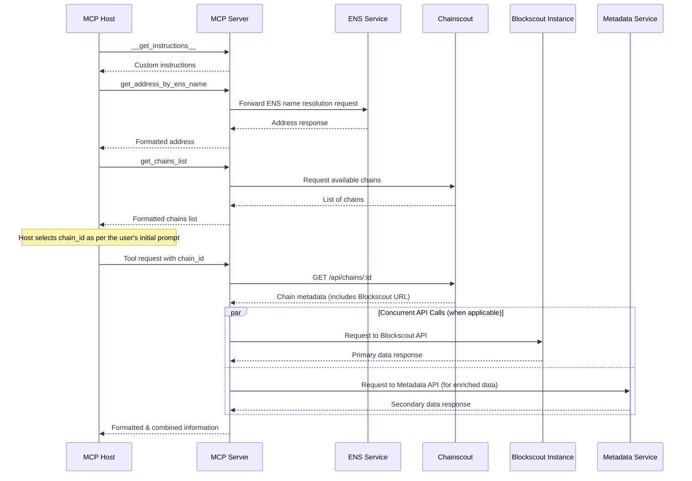
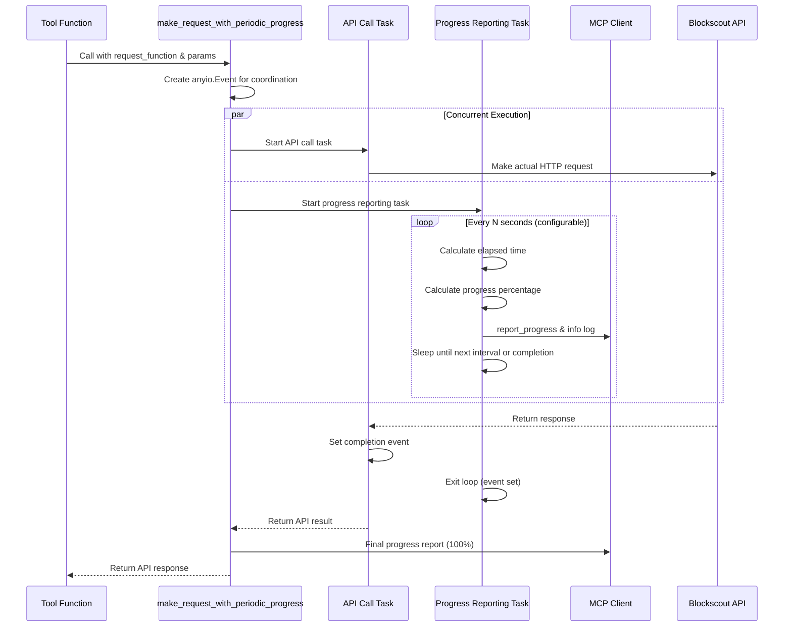

# Blockscout MCP Server

This server wraps Blockscout APIs and exposes blockchain data—balances, tokens, NFTs, contract metadata—via MCP so that AI agents and tools (like Claude, Cursor, or IDEs) can access and analyze it contextually.

## Technical details

- The server is built using [MCP Python SDK](https://github.com/modelcontextprotocol/python-sdk) and Httpx.

### Operational Modes

The Blockscout MCP Server supports two operational modes:

1. **Stdio Mode (Default)**:
   - Designed for integration with MCP hosts/clients (Claude Desktop, Cursor, MCP Inspector, etc.)
   - Uses stdin/stdout communication following the MCP JSON-RPC 2.0 protocol
   - Automatically spawned and managed by MCP clients
   - Provides session-based interaction with progress tracking and context management

2. **HTTP Streamable Mode**:
   - Modern HTTP-based mode using the same MCP JSON-RPC 2.0 protocol over HTTP
   - Stateless operation with JSON responses for improved scalability
   - Convenient for testing with standard HTTP tools (curl, Postman, etc.) especially by AI agents and coding assistants
   - Not yet universally supported by all MCP clients, but growing in adoption

Both modes provide identical functionality and tool capabilities, differing only in the transport mechanism.

### Architecture and Data Flow



### Workflow Description

1. **Instructions Retrieval**:
   - MCP Host requests custom instructions via `__get_instructions__`
   - MCP Server provides context-specific guidance

2. **ENS Resolution**:
   - MCP Host requests address resolution via `get_address_by_ens_name`
   - MCP Server forwards the request to Blockscout ENS Service
   - Response is processed and formatted before returning to the agent

3. **Chain Selection**:
   - MCP Host requests available chains via `get_chains_list`
   - MCP Server retrieves chain data from Chainscout
   - MCP Host selects appropriate chain based on user needs

4. **Optimized Data Retrieval with Concurrent API Calls**:
   - The MCP Server employs concurrent API calls as a performance optimization whenever tools need data from multiple sources. Examples include:
     - `get_address_info`: Concurrent requests to Blockscout API (for on-chain data) and Metadata API (for public tags)
     - `get_block_info` with transactions: Concurrent requests for block data and transaction list from the same Blockscout instance
   - This approach significantly reduces response times by parallelizing independent API calls rather than making sequential requests. The server combines all responses into a single, comprehensive response for the agent.

5. **Blockchain Data Retrieval**:
   - MCP Host requests blockchain data (e.g., `get_latest_block`) with specific chain_id, optionally requesting progress updates
   - MCP Server, if progress is requested, reports starting the operation
   - MCP Server queries Chainscout for chain metadata including Blockscout instance URL
   - MCP Server reports progress after resolving the Blockscout URL
   - MCP Server forwards the request to the appropriate Blockscout instance
   - For potentially long-running API calls (e.g., advanced transaction filters), MCP Server provides periodic progress updates every 15 seconds (configurable via `BLOCKSCOUT_PROGRESS_INTERVAL_SECONDS`) showing elapsed time and estimated duration
   - MCP Server reports progress after fetching data from Blockscout
   - Response is processed and formatted before returning to the agent

### Key Architectural Decisions

1. **Tool Selection and Context Optimization**:
   - Not all Blockscout API endpoints are exposed as MCP tools
   - The number of tools is deliberately kept minimal to prevent diluting the LLM context
   - Too many tools make it difficult for the LLM to select the most appropriate one for a given user prompt
   - Some MCP Hosts (e.g., Cursor) have hard limits on the number of tools (capped at 50)
   - Multiple MCP servers might be configured in a client application, with each server providing its own tool descriptions
   - Tool descriptions are limited to 1024 characters to minimize context consumption

2. **The Standardized `ToolResponse` Model**

   To provide unambiguous, machine-readable responses, the server enforces a standardized, structured response format for all tools. This moves away from less reliable string-based outputs and aligns with modern API best practices.

   Every tool in the server returns a `ToolResponse` object. This Pydantic model serializes to a clean JSON structure, which clearly separates the primary data payload from associated metadata.

   The core structure is as follows:

   - `data`: The main data payload of the tool's response. The schema of this field can be specific to each tool.
   - `data_description`: An optional list of strings that explain the structure, fields, or conventions of the `data` payload (e.g., "The `method_call` field is actually the event signature...").
   - `notes`: An optional list of important contextual notes, such as warnings about data truncation or data quality issues. This field includes guidance on how to retrieve full data if it has been truncated.
   - `instructions`: An optional list of suggested follow-up actions for the LLM to plan its next steps. When pagination is available, the server automatically appends pagination instructions to motivate LLMs to fetch additional pages.
   - `pagination`: An optional object that provides structured information for retrieving the next page of results.

   This approach provides immense benefits, including clarity for the AI, improved testability, and a consistent, predictable API contract.

   **Example: Comprehensive ToolResponse Structure**

   This synthetic example demonstrates all features of the standardized `ToolResponse` format that tools use to communicate with the AI agent. It shows how the server structures responses with the primary data payload, contextual metadata, pagination, and guidance for follow-up actions.

    ```json
    {
      "data": [
        {
          "block_number": 19000000,
          "transaction_hash": "0x1a2b3c4d5e6f...",
          "token_symbol": "USDC",
          "amount": "1000000000",
          "from_address": "0xa1b2c3d4e5f6...",
          "to_address": "0xf6e5d4c3b2a1...",
          "raw_data": "0x1234...",
          "raw_data_truncated": true,
          "decoded_data": {
            "method": "transfer",
            "parameters": [
              {"name": "to", "value": "0xf6e5d4c3b2a1...", "type": "address"},
              {"name": "amount", "value": "1000000000", "type": "uint256"}
            ]
          }
        }
      ],
      "data_description": [
        "Response Structure:",
        "- `block_number`: Block height where the transaction was included",
        "- `token_symbol`: Token ticker (e.g., USDC, ETH, WBTC)",
        "- `amount`: Transfer amount in smallest token units (wei for ETH)",
        "- `raw_data`: Transaction input data (hex encoded). **May be truncated.**",
        "- `raw_data_truncated`: Present when `raw_data` field has been shortened",
        "- `decoded_data`: Human-readable interpretation of the raw transaction data"
      ],
      "notes": [
        "Large data fields have been truncated to conserve context (indicated by `*_truncated: true`).",
        "For complete untruncated data, retrieve it directly:",
        "`curl \"https://eth.blockscout.com/api/v2/transactions/0x1a2b3c4d5e6f.../raw-trace\"`"
      ],
      "instructions": [
        "Use `get_address_info` to get detailed information about any address in the results",
        "Use `get_transaction_info` to get full transaction details including gas usage and status",
        "⚠️ MORE DATA AVAILABLE: Use pagination.next_call to get the next page.",
        "Continue calling subsequent pages if you need comprehensive results."
      ],
      "pagination": {
        "next_call": {
          "tool_name": "get_address_transactions", 
          "params": {
            "chain_id": "1",
            "address": "0xa1b2c3d4e5f6...",
            "cursor": "eyJibG9ja19udW1iZXIiOjE4OTk5OTk5LCJpbmRleCI6NDJ9"
          }
        }
      }
      }
      ```

3. **Response Processing and Context Optimization**:

   The server employs a comprehensive strategy to **conserve LLM context** by intelligently processing API responses before forwarding them to the MCP Host. This prevents overwhelming the LLM context window with excessive blockchain data, ensuring efficient tool selection and reasoning.

   **Core Approach:**
   - Raw Blockscout API responses are never forwarded directly to the MCP Host
   - All responses are processed to extract only tool-relevant data
   - Large datasets (e.g., token lists with hundreds of entries) are filtered and formatted to include only essential information

   **Specific Optimizations:**

    **a) Address Object Simplification:**
    Many Blockscout API endpoints return addresses as complex JSON objects containing hash, name, contract flags, public tags, and other metadata. To conserve LLM context, the server systematically simplifies these objects into single address strings (e.g., `"0x123..."`) before returning responses. This approach:

    - **Reduces Context Consumption**: A single address string uses significantly less context than a full address object with multiple fields
    - **Encourages Compositional Tool Use**: When detailed address information is needed, the AI is guided to use dedicated tools like `get_address_info`
    - **Maintains Essential Functionality**: The core address hash is preserved, which is sufficient for most blockchain operations

    **b) Opaque Cursor Strategy for Pagination:**
    For handling large, paginated datasets, the server uses an **opaque cursor** strategy that avoids exposing multiple, complex pagination parameters (e.g., `page`, `offset`, `items_count`) in tool signatures and responses. This approach provides several key benefits:

    - **Context Conservation**: A single cursor string consumes significantly less LLM context than a list of individual parameters.
    - **Improved Robustness**: It treats pagination as an atomic unit, preventing the AI from incorrectly constructing or omitting parameters for the next request.
    - **Simplified Tool Signatures**: Tool functions only need one optional `cursor: str` argument for pagination, keeping their schemas clean.

    **Mechanism:**
    When the Blockscout API returns a `next_page_params` dictionary, the server serializes this dictionary into a compact JSON string, which is then Base64URL-encoded. This creates a single, opaque, and URL-safe string that serves as the cursor for the next page.

    **Example:**

    - **Blockscout API `next_page_params`:**

       ```json
       { "block_number": 18999999, "index": 42, "items_count": 50 }
       ```

    - **Generated Opaque Cursor:**
       `eyJibG9ja19udW1iZXIiOjE4OTk5OTk5LCJpbmRleCI6NDIsIml0ZW1zX2NvdW50Ijo1MH0`

    - **Final Tool Response (JSON):**

       ```json
       {
         "data": [...],
         "pagination": {
           "next_call": {
             "tool_name": "get_address_logs",
             "params": {
               "chain_id": "1",
               "address": "0x...",
               "cursor": "eyJibG9ja19udW1iZXIiOjE4OTk5OTk5LCJpbmRleCI6NDIsIml0ZW1zX2NvdW50Ijo1MH0"
             }
           }
         }
       }
      ```

    **c) Response Slicing and Context-Aware Pagination:**
    To prevent overwhelming the LLM with long lists of items (e.g., token holdings, transaction logs), the server implements a response slicing strategy. This conserves context while ensuring all data remains accessible through robust pagination.

    - **Mechanism**: The server fetches a full page of data from the Blockscout API (typically 50 items) but returns only a smaller, configurable slice to the client (e.g., 10 items). If the original response contained more items than the slice size, pagination is initiated.
    - **Cursor Generation**: Instead of using the `next_page_params` directly from the Blockscout API (which would skip most of the fetched items), the server generates a new pagination cursor based on the **last item of the returned slice**. This ensures the next request starts exactly where the previous one left off, providing seamless continuity.
    - **Configuration**: The size of the slice returned to the client is configurable via environment variables (e.g., `BLOCKSCOUT_NFT_PAGE_SIZE`), allowing for fine-tuning of context usage.

    This strategy combines the network efficiency of fetching larger data chunks from the backend with the context efficiency of providing smaller, digestible responses to the AI.

    **c) Response Slicing and Context-Aware Pagination:**

    To prevent overwhelming the LLM with long lists of items (e.g., token holdings, transaction logs), the server implements a response slicing strategy. This conserves context while ensuring all data remains accessible through robust pagination.

    **Basic Slicing Mechanism:**

    - The server fetches a full page of data from the Blockscout API (typically 50 items) but returns only a smaller, configurable slice to the client (e.g., 10 items). If the original response contained more items than the slice size, pagination is initiated.
    - **Cursor Generation**: Instead of using the `next_page_params` directly from the Blockscout API (which would skip most of the fetched items), the server generates a new pagination cursor based on the **last item of the returned slice**. This ensures the next request starts exactly where the previous one left off, providing seamless continuity.
    - **Configuration**: The size of the slice returned to the client is configurable via environment variables (e.g., `BLOCKSCOUT_*_PAGE_SIZE`), allowing for fine-tuning of context usage.

    **Advanced Multi-Page Fetching with Filtering:**
    For tools that apply significant filtering (e.g., `get_transactions_by_address` which excludes token transfers), the server implements a sophisticated multi-page fetching strategy to handle cases where filtering removes most items from each API page:

    - **Smart Pagination Logic**: The server fetches up to 10 consecutive full-size pages from the Blockscout API, filtering and accumulating items until it has enough for a meaningful client response.
    - **Sparse Data Detection**: If after fetching 10 pages the last page contained no filtered items and the accumulated results are still insufficient for a full client page, the data is considered "too sparse" and pagination is terminated to avoid infinite loops with minimal results.
    - **Pagination Decision**: The server offers pagination to the client only when:
      1. It has accumulated more than the target page size (definitive evidence of more data), OR
      2. It reached the 10-page limit AND the last fetched page contained items AND the API indicates more pages are available (likely more data)
    - **Efficiency Balance**: This approach balances network efficiency (fetching larger chunks) with context efficiency (returning smaller slices) while handling the complex reality of heavily filtered blockchain data.

    This strategy combines the network efficiency of fetching larger data chunks from the backend with the context efficiency of providing smaller, digestible responses to the AI.

    **d) Automatic Pagination Instructions for LLM Guidance:**

    To address the common issue of LLMs ignoring structured pagination data, the server implements a multi-layered approach to ensure LLMs actually use pagination when available:

    - **Enhanced General Rules**: Server instructions include explicit pagination handling rules that LLMs receive upfront
    - **Automatic Instruction Generation**: When a tool response includes pagination, the server automatically appends motivational instructions to the `instructions` field (e.g., "⚠️ MORE DATA AVAILABLE: Use pagination.next_call to get the next page.")
    - **Tool Description Enhancement**: All paginated tools include prominent **"SUPPORTS PAGINATION"** notices in their docstrings

    This balanced approach provides both human-readable motivation and machine-readable execution details, significantly improving the likelihood that LLMs will fetch complete datasets for comprehensive analysis.

    **e) Log Data Field Truncation**

    To prevent LLM context overflow from excessively large `data` fields in transaction logs, the server implements a smart truncation strategy.

    - **Mechanism**: If a log's `data` field (a hex string) exceeds a predefined limit of 514 characters (representing 256 bytes of data plus the '0x' prefix), it is truncated.
    - **Flagging**: A new boolean field, `data_truncated: true`, is added to the log item to explicitly signal that the data has been shortened.
    - **Decoded Truncation**: Oversized string values inside the `decoded` dictionary are recursively replaced with `{"value_sample": "...", "value_truncated": true}`.
    - **Guidance**: When truncation occurs, a note is added to the tool's output. This note explains the flag and provides a `curl` command template, guiding the agent on how to programmatically fetch the complete, untruncated data if required for deeper analysis.

    This approach maintains a small context footprint by default while providing a reliable "escape hatch" for high-fidelity data retrieval when necessary.

    **f) Transaction Input Data Truncation**

    To handle potentially massive transaction input data, the `get_transaction_info` tool employs a multi-faceted truncation strategy.

    - **`raw_input` Truncation**: If the raw hexadecimal input string exceeds `INPUT_DATA_TRUNCATION_LIMIT`, it is shortened. A new flag, `raw_input_truncated: true`, is added to the response to signal this.
    - **`decoded_input` Truncation**: The server recursively traverses the nested `parameters` of the decoded input. Any string value (e.g., a `bytes` or `string` parameter) exceeding the limit is replaced by a structured object: `{"value_sample": "...", "value_truncated": true}`. This preserves the overall structure of the decoded call while saving significant context.
    - **Instructional Note**: If any field is truncated, a note is appended to the tool's output, providing a `curl` command to retrieve the complete, untruncated data, ensuring the agent has a path to the full information if needed.

4. **Instructions Delivery Workaround**:
   - Although the MCP specification defines an `instructions` field in the initialization response (per [MCP lifecycle](https://modelcontextprotocol.io/specification/2025-03-26/basic/lifecycle#initialization)), current MCP Host implementations (e.g., Claude Desktop) do not reliably use these instructions
   - The `__get_instructions__` tool serves as a workaround for this limitation
   - The tool's description forces the MCP Host to call it before any other tools in the session
   - These custom instructions are crucial for providing the LLM with blockchain-specific context
   - Instructions could include information about chain IDs, common error handling patterns, and examples of how to reason about blockchain data and DeFi protocols

### Performance Optimizations and User Experience

#### Periodic Progress Tracking for Long-Running API Calls

The server implements sophisticated progress tracking for potentially long-running API operations, particularly for tools that query the Blockscout `/api/v2/advanced-filters` endpoint (such as `get_transactions_by_address` and `get_token_transfers_by_address`). This feature significantly improves user experience by providing real-time feedback during operations that may take 30 seconds or more.

**Technical Implementation:**

The progress tracking system uses a wrapper function (`make_request_with_periodic_progress`) that employs concurrent task execution to provide periodic updates without blocking the actual API call. The implementation leverages Python's `anyio` library for structured concurrency.



**Key Implementation Details:**

1. **Concurrent Task Management**: Uses `anyio.create_task_group()` to run the API call and progress reporting concurrently
2. **Event-Driven Coordination**: An `anyio.Event` coordinates between tasks - the progress task continues until the API task signals completion
3. **Dynamic Progress Calculation**: Progress within the current step is calculated as `min(elapsed_time / expected_duration, 1.0)` to ensure it never exceeds 100%
4. **Multi-Step Integration**: The wrapper integrates seamlessly with the overall tool progress tracking by accepting `tool_overall_total_steps` and `current_step_number` parameters
5. **Configurable Intervals**: Progress reporting frequency is configurable via `BLOCKSCOUT_PROGRESS_INTERVAL_SECONDS` (default: 15 seconds)
6. **Error Handling**: Exceptions from the API call are properly propagated while ensuring progress task cleanup

#### Enhanced Observability with Logging

While `report_progress` is the standard for UI feedback, many MCP clients do not yet render progress notifications but do capture log messages. To provide essential real-time feedback for development and debugging, the server now systematically pairs every progress notification with a corresponding `info` log message.

This is achieved via a centralized `report_and_log_progress` helper function. This dual-reporting mechanism ensures that:

1. **Compliant clients** can use the structured `progress` notifications to build rich UIs.
2. **All other clients** receive human-readable log entries (e.g., `Progress: 1.0/2.0 - Step complete`), eliminating the "black box" effect during long-running operations and improving debuggability.
